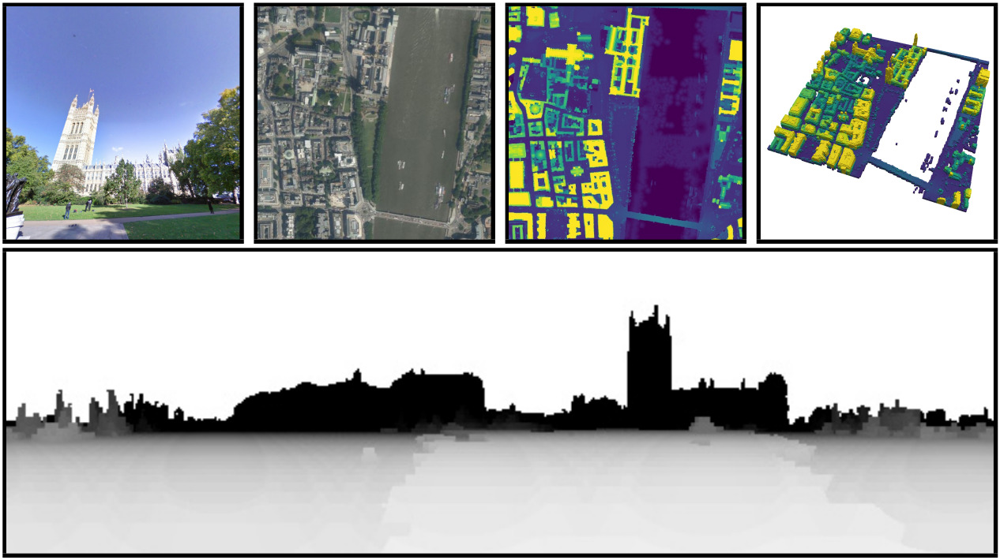

<div align="center">
  <h1> Augmenting Depth Estimation <br/> with Geospatial Context </h1>
  
  [](https://arxiv.org/abs/2109.09879)
  [](https://www.scottworkman.com/research/geodepth/)</center>
    
  [Scott Workman](https://scottworkman.com/) and 
  [Hunter Blanton](https://hblanton.github.io/), ICCV 2021

</div>

[](https://www.scottworkman.com/research/geodepth/)

## Table of Contents

- [Table of Contents](#table-of-contents)
- [Get Started](#get-started)
  - [Installation](#installation)
  - [Train and Evaluate](#train-and-evaluate)
  - [Visualize](#visualize)
- [HoliCity-Overhead Dataset](#holicity-overhead-dataset)
  - [Download](#download)
  - [Precompute Context](#precompute-context)
- [Publications](#publications)
- [License](#license)

## Get started

### Installation

1. Clone the repository.
```bash
git clone https://github.com/scottworkman/geodepth
cd geodepth
```

2. Create and activate the environment (e.g., using [conda](https://github.com/conda-forge/miniforge)).

```bash
conda env create -f resources/environment.yml
conda activate geodepth
```                  

### Train and Evaluate

To train our approach:
```bash
python main.py
```

To train other variants of our approach, as described in the paper, adjust the input arguments:
```bash
python main.py --help
```
For example:
```bash
python main.py --method=ground
```

To evaluate:
```bash
cd eval
python compute_metrics.py
```

### Visualize

The example notebook `idea/geodepth.ipynb` demonstrates the core idea of this work. For visualizing results, see `visualize/predictions.ipynb`.

## HoliCity-Overhead Dataset

Our dataset can be obtained using the links below. The scripts in this repository asume the dataset lives at `holicity-overhead/` under the root directory. Extract the dataset wherever you like and then create a symbolic link:

```bash
ln -s /path/to/dataset holicity-overhead
```

Disclaimer: The overhead imagery is owned and copyrighted by Microsoft and must not be used for any commercial purposes.

### Download

- [HoliCity-Overhead](https://drive.google.com/file/d/1hdVvxyQAfaSKoPBMH4ysv7LYb7HVxDds/view?usp=sharing)
  - overhead imagery and height maps
- [HoliCity-Overhead (full)](https://drive.google.com/file/d/1bycVS7lADKi41wD2JsrTAfzMA_UDvq7F/view?usp=sharing)
  - HoliCity-Overhead combined with the necessary components from HoliCity to support training

### Precompute Context
 
Methods that start from a known height map use precomputed geospatial context (in the form of a synthetic depth image) to reduce computational overhead:
```bash
cd scripts
python precompute_context.py
```

## Publications

Please cite our paper if you find this work helpful:
```bibtex
@inproceedings{workman2021augmenting,
  author={Scott Workman and Hunter Blanton},
  title={{Augmenting Depth Estimation with Geospatial Context}},
  booktitle={{IEEE International Conference on Computer Vision (ICCV)}},
  year=2021
}
```

This project builds on the HoliCity dataset:
```bibtex
@article{zhou2020holicity,
  author={Zhou, Yichao and Huang, Jingwei and Dai, Xili and Liu, Shichen and Luo,
          Linjie and Chen, Zhili and Ma, Yi},
  title={HoliCity: A city-scale data platform for learning holistic 3D structures},
  journal={arXiv preprint arXiv:2008.03286},
  year={2020}
}
```

## License

The code is distributed under the CC BY-NC-SA 4.0 License.
See [LICENSE](LICENSE) for more information.

```python
# Copyright © Scott Workman. 2025. All rights reserved.
# Licensed under CC BY-NC-SA 4.0 (non-commercial use only).
```
